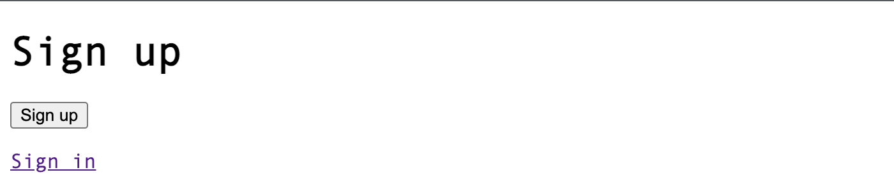
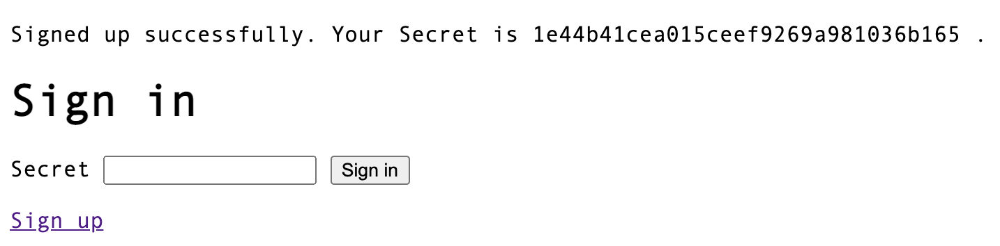

# Aikotoba

Aikotoba meaning password in Japanese.

Aikotoba is a Rails engine that makes it easy to implement very simple password-only authentication.

**[Caution](#caution)**

## Demo

Sign up


Sign in


## Installation

Add this line to your application's Gemfile:

```ruby
gem 'aikotoba'
```

## Usage

### Getting Start

Aikotoba use `secret_digest` for authentication. Add it to the model(ex. `User`) used for authentication.

```sh
$ bin/rails g User secret_digest:string
# or
$ bin/rails g migration AddSecretDigestToUsers secret_digest:string
```

include `Aikotoba::ModelHelper` to the model(ex. `User`) used for authentication.

```ruby
class User < ApplicationRecord
  include Aikotoba::ModelHelper
end
```

Mount `Aikotoba::Engine` your application.

```ruby
Rails.application.routes.draw do
  mount Aikotoba::Engine => "/"
end
```

Aikotoba enabled routes for authentication.

| HTTP Verb | Path      | Overview                                                                |
| --------- | --------- | ----------------------------------------------------------------------- |
| GET       | /sign_in  | Display sign in page.                                                   |
| POST      | /sign_in  | Create a login session by authenticating with the password you entered. |
| GET       | /sign_up  | Display sign up page.                                                   |
| POST      | /sign_up  | Create an account and view the password generated by the application.   |
| DELETE    | /sign_out | Clear aikotoba login session.                                           |

include `Aikotoba::ControllerHelper` to the controller(ex. `ApplicationController`) use authentication.

```ruby
class ApplicationController < ActionController::Base
  include Aikotoba::ControllerHelper
end
```

Aikotoba enable helper methods for authentication(ex. `current_user`, `authenticate_user!`) .

```ruby
class ApplicationController < ActionController::Base
  include Aikotoba::ControllerHelper
end

class SensitiveController < ApplicationController
  before_action :authenticate_user!

  def index
    @records = current_user.sensitive_records
  end
end
```

### Configuration

The following configuration parameters are supported. You can override it. (ex. `initializers/aikotoba.rb`)

```ruby
require 'aikotoba'

Aikotoba.authenticate_class = "User"
Aikotoba.authenticate_account_method = "current_user"
Aikotoba.authorize_account_method = "authenticate_user!"
Aikotoba.session_key = "aikotoba-user-id"
Aikotoba.prevent_timing_atack = true
Aikotoba.secret_generator = -> { SecureRandom.hex(16) }
Aikotoba.secret_papper = "aikotoba-default-pepper"
Aikotoba.secret_stretch = 3
Aikotoba.secret_digest_generator = ->(secret) { Digest::SHA256.hexdigest(secret) }
Aikotoba.sign_in_path = "/sign_in"
Aikotoba.sign_up_path = "/sign_up"
Aikotoba.sign_out_path = "/sign_out"
Aikotoba.after_sign_in_path = "/"
Aikotoba.failed_sign_in_path = "/sign_in"
Aikotoba.after_sign_up_path = "/sign_in"
Aikotoba.after_sign_out_path = "/sign_in"
Aikotoba.appeal_sign_in_path = "/sign_in"
```

### Customize Message

All Messages are managed by `i18n` and can be freely overridden.

## Caution

Aikotoba is intended to be used during development to implement simple authentication with only a password, and is not intended to be used in a production.

If you use Aikotoba in a production environment, please be careful about comments in the code and other security issues.

## Contributing

Bug reports and pull requests are welcome on GitHub.

## License

The gem is available as open source under the terms of the [MIT License](https://opensource.org/licenses/MIT).
