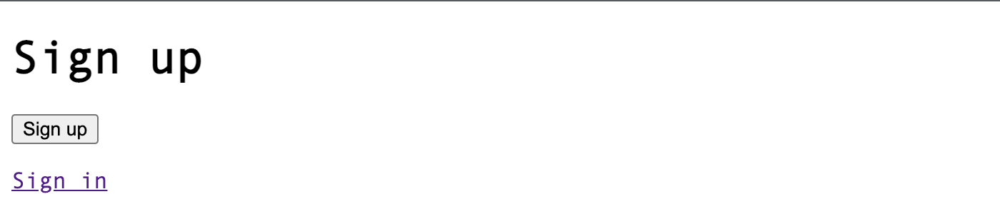
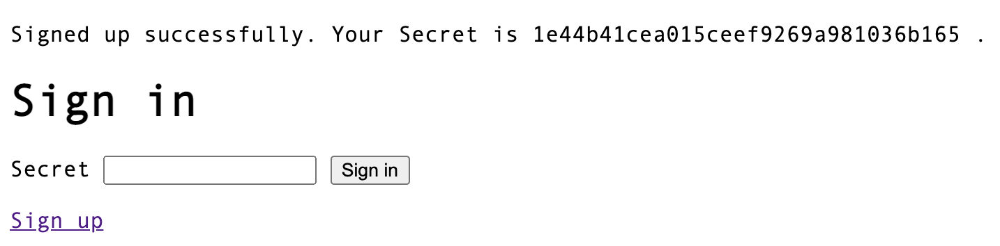

# Aikotoba

Aikotoba meaning password in Japanese.

Aikotoba is a Rails engine that makes it easy to implement simple authentication.

**Available Strategies**

- `email_password`(default): email and password authentication.
- `password_only`: only password authentication.
  - password_only is simple authentication with only a password, and is not intended to be used in a production. If you use in a production environment, please be careful about comments in the code and other security issues.

## Demo

### email_password

Sign up


Sign in


### password_only

Sign up


Sign in


## Installation

Add this line to your application's Gemfile:

```ruby
gem 'aikotoba'
```

## Usage

### Getting Start

Aikotoba use `Aikotoba::Account` for authentication. Add it to the migration for `Aikotoba::Account`.

```sh
$ bin/rails aikotoba:install:migrations
```

Mount `Aikotoba::Engine` your application.

```ruby
Rails.application.routes.draw do
  mount Aikotoba::Engine => "/"
end
```

Aikotoba enabled routes for authentication.

| HTTP Verb | Path      | Overview                                  |
| --------- | --------- | ----------------------------------------- |
| GET       | /sign_in  | Display sign in page.                     |
| POST      | /sign_in  | Create a login session by authenticating. |
| GET       | /sign_up  | Display sign up page.                     |
| POST      | /sign_up  | Create an account.                        |
| DELETE    | /sign_out | Clear aikotoba login session.             |

include `Aikotoba::Authorizable` and `Aikotoba::Authenticatable` to the controller(ex. `ApplicationController`) use authentication.

```ruby
class ApplicationController < ActionController::Base
  include Aikotoba::Authorizable # enabled authorizable methods (ex. `authenticate_user!`)
  include Aikotoba::Authenticatable # enabled authenticatable methods (ex. `current_user`)
end
```

Aikotoba enable helper methods for authentication.

```ruby
class SensitiveController < ApplicationController
  before_action :authenticate_user!

  def index
    @records = current_user.sensitive_records
  end
end
```

### Configuration

The following configuration parameters are supported. You can override it. (ex. `initializers/aikotoba.rb`)

```ruby
require 'aikotoba'

Aikotoba.authenticate_account_method = "current_user"
Aikotoba.authorize_account_method = "authenticate_user!"
Aikotoba.authentication_strategy = :email_password
Aikotoba.prevent_timing_atack = true
Aikotoba.password_papper = "aikotoba-default-pepper"
Aikotoba.password_stretch = 3
Aikotoba.sign_in_path = "/sign_in"
Aikotoba.sign_up_path = "/sign_up"
Aikotoba.sign_out_path = "/sign_out"
Aikotoba.after_sign_in_path = "/"
Aikotoba.failed_sign_in_path = "/sign_in"
Aikotoba.after_sign_up_path = "/sign_in"
Aikotoba.after_sign_out_path = "/sign_in"
Aikotoba.appeal_sign_in_path = "/sign_in"
```

### Customize Message

All Messages are managed by `i18n` and can be freely overridden.

### Create other model with `Aikotoba::Account`.

You can override `Aikotoba::AccountsController#after_create_account_process` to create the other models together.

```ruby
require 'aikotoba'

Rails.application.config.to_prepare do
  Aikotoba::AccountsController.class_eval do
    def after_create_account_process
      profile = Profile.new(nickname: "foo")
      profile.save!
      @account.update!(authenticate_target: profile)
    end
  end
end

class Profile < ApplicationRecord
  has_one :user, -> { your_strategy }, class_name: 'Aikotoba::Account'
end

current_user.profile #=> Profile instance
profile.user #=> Aikotoba::Account instance
```

## Contributing

Bug reports and pull requests are welcome on GitHub.

## License

The gem is available as open source under the terms of the [MIT License](https://opensource.org/licenses/MIT).
